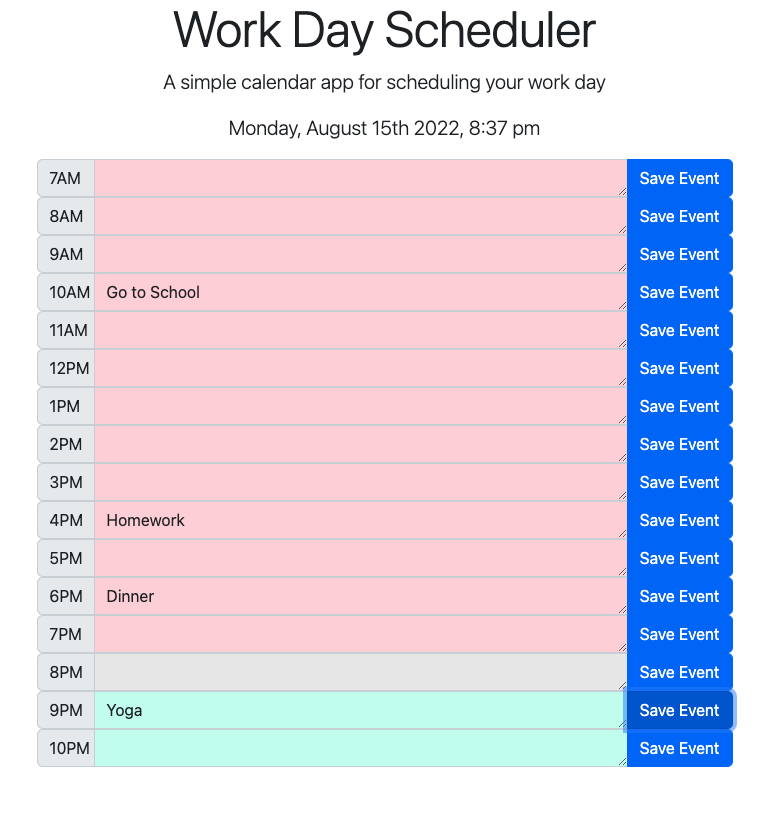

# work-day-scheduler
## Description
The purpose of this application is to help the user schedule their work day. The page displays the current date and time. The page has several blocks of time in which the user can input their events for the day. The event blocks are color coordinated based on whether or not that time of day has passed. 

### Working Webpage Image

### Link to Deployed Webpage
[Work Day Sceduler](https://kamarygillespie4.github.io/work-day-scheduler/)
## Table of Contents

 [Technologies Used](#technologies)
 [Installation Instructions](#installation)
 [Usage Information](#usage)
 [Contribution Guidelines](#contribution)
 [Testing](#testing)
 [License information](#Licensing)
[Questions](#questions)

## Technologies

This application was created using javascript, HTML, and CSS.

## Installation

This application requires no installation.

## Usage

To use this application, open the web page in the browser. From here you will be able to enter in your events in the wanted time block and save them. The events will remain there even if you close the browser window and reopen it!

## Contribution

There were no other contributions to this application.

## Testing

This application has no testing.

## Licensing

This application has no license.

## Questions

If you have any further questions,

- You can email me at: kami.gillespie@gmail.com
- You can find my GitHub at: [kamarygillespie4](https://github.com/kamarygillespie4)

